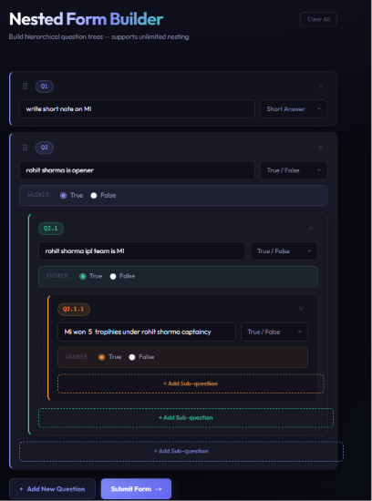
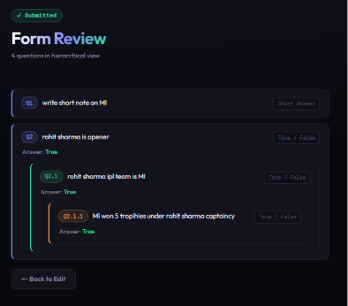

<div align="center">

# 🧩 Nested Form Builder

### *Build infinite question trees. Dynamically. Beautifully.*


</div>

---

## 🚀 What is this?

A **dynamic nested form builder** built with React where users can create questions, nest sub-questions infinitely deep, reorder them with drag-and-drop, and submit a full hierarchical review — all with a sleek dark UI and zero backend.

> 💡 True/False questions unlock child sub-questions. Short Answer keeps it clean. Go as deep as you want.

---

## 📸 Screenshots

### 🏗️ Building the Form


### ✅ Submitted Hierarchical View


---

## ✨ Features

| Feature | Description |
|--------|-------------|
| ➕ **Add Questions** | Dynamically add unlimited parent questions |
| 🔀 **Two Question Types** | Short Answer or True / False |
| 🌿 **Infinite Nesting** | True/False → True unlocks child sub-questions recursively |
| 🔢 **Auto Numbering** | Q1 → Q1.1 → Q1.1.1 — always accurate |
| 🗑️ **Delete Anywhere** | Remove any question + all its children instantly |
| 🖱️ **Drag & Drop** | Reorder parent questions with smooth drag-and-drop |
| 💾 **Auto Save** | Every change saved to LocalStorage automatically |
| 📋 **Submit & Review** | Full hierarchical read-only view on submission |
| 📱 **Responsive** | Works on all screen sizes |

---

## 🛠️ Tech Stack

```
React 18          →  UI & state management (hooks only)
@dnd-kit          →  Drag and drop reordering
LocalStorage API  →  Zero-backend auto persistence
CSS3 (1 file)     →  All styles in src/styles/styles.css
Outfit + DM Mono  →  Google Fonts typography
```

---

## 📁 Project Structure

```
nested-form/
│
├── 📂 public/
│   └── index.html
│
├── 📂 src/
│   ├── 📄 App.jsx                  ← Root component, all state lives here
│   ├── 📄 index.js                 ← React entry point
│   │
│   ├── 📂 components/
│   │   ├── 📄 Question.jsx         ← Recursive question component
│   │   └── 📄 SubmitView.jsx       ← Read-only hierarchical review
│   │
│   ├── 📂 utils/
│   │   └── 📄 questionUtils.js     ← Pure helper functions
│   │
│   └── 📂 styles/
│       └── 📄 styles.css           ← ALL CSS in one file (18 sections)
│
├── 📂 screenshots/
│   ├── 🖼️ ss1.png                  ← Form builder view
│   └── 🖼️ ss2.png                  ← Submit review view
│
├── 📄 .gitignore
├── 📄 package.json
└── 📄 README.md
```

---

## ⚡ Getting Started

### Prerequisites
- Node.js installed on your machine
- npm (comes with Node.js)

### Installation & Run

```bash
# Step 1 — Clone the repository
git clone https://github.com/YOUR_USERNAME/YOUR_REPO_NAME.git

# Step 2 — Navigate into the project
cd YOUR_REPO_NAME

# Step 3 — Install dependencies
npm install

# Step 4 — Start the development server
npm start
```

App runs at **http://localhost:3000** 🎉

---

## 🧠 How It Works

### Data Model
Every question is a recursive object:

```js
{
  id: string,           // unique id
  text: string,         // question text
  type: 'short' | 'truefalse',
  answer: '' | 'true' | 'false',
  children: Question[]  // nested sub-questions (unlimited depth)
}
```

### Key Logic
- **Auto-numbering** — prefix string passed down recursively as a prop (`Q1` → `Q1.1` → `Q1.1.1`)
- **Recursive update/delete** — pure functions in `questionUtils.js` walk the tree without mutation
- **Drag-and-drop** — only top-level questions are sortable via `@dnd-kit/sortable`
- **LocalStorage** — `useEffect` writes full tree on every state change, loaded on mount

---

## 📦 Dependencies

```json
{
  "react": "^18.2.0",
  "react-dom": "^18.2.0",
  "@dnd-kit/core": "^6.1.0",
  "@dnd-kit/sortable": "^8.0.0",
  "@dnd-kit/utilities": "^3.2.2"
}
```

---

<div align="center">

Made with 💜 using React

</div>